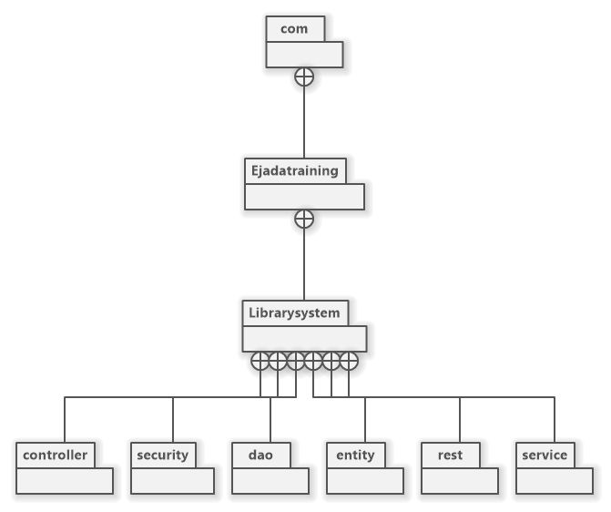

**Technologies Used** (So Far):

-   Spring Boot (Embedded with Tomcat Server).

-   Spring Security.

-   Spring Validation.

-   Maven

-   JSP, for simple login pages.

-   Bootstrap.

-   JQuery.

**How to run**:

1.  In your IDE, perform a Maven clean install.

2.  Run
    "com.​Ejadatraining.​Librarysystem.LibrarySystemApplication.java"

# Diagrams

## Class Diagrams

**Package Structure**

{width="5.510416666666667in"
height="4.6170745844269465in"}

**Package:**
**rest**{width="6.489583333333333in"
height="3.8020833333333335in"}

**Package: Entities**

{width="6.130347769028871in"
height="4.791666666666667in"}

**Package: Service**

{width="6.489583333333333in"
height="5.875in"}

**Package: DAO**

{width="6.489583333333333in"
height="4.333333333333333in"}

## Entity Relation Diagram (Database)

{width="6.5in"
height="4.927083333333333in"}
